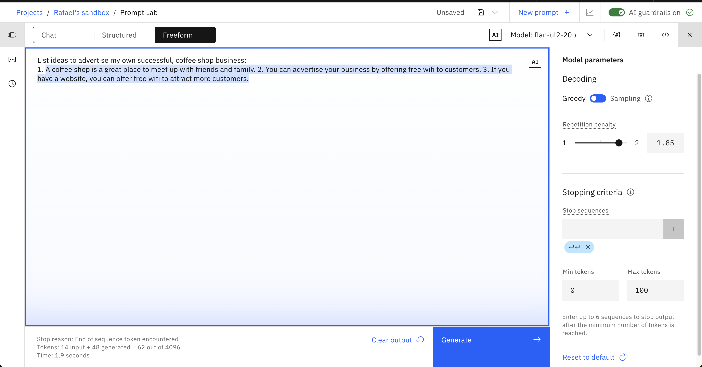

# Basics of Prompt Engineering

**Note:** The following images show actual results from watsonx.ai. The gray text is what we provided to the model. The blue highlighted text is how the model responded.

### 1.0 LLM Foundations
Before we jump into exploring the capabilities of Prompt Lab, we first need to lay a foundation for how Large Language Models (LLMs) work, and how we can tune the model and parameters to change their output. Gaining this understanding will make us more effective at prompt engineering.


When you open up Prompt Lab and click the `Freeform` mode-option, this is what you will be shown. The large central text area is the prompt editor. On the right-side, you can display the model parameters that you can use to select to optimize how the model responds to your prompt. On the bottom-left a summary of the number of tokens used by your prompt during execution will display when we generate a response:


### 1.1 Tokens

Each time you enter a prompt, your **input** tokens and **generated** tokens will update. Tokens are an important concept to understand as they constrain the performance of your model plus determine the cost of using models. As you will learn throughout the labs, tokens are not a 1:1 match with words in natural language. On average, one token is equal to 4 characters. Before sending your prompt to the model, the prompt's text is _tokenized_ or broken into smaller subsets of characters better understood by a model.

It is important to monitor your token usage to know how much information you are feeding into the model with each prompt, as well as how much text is generated for you. Depending on the model selected in Prompt Lab, you will see a max of 2048 or 4096 tokens. Keep in mind that the more expressive you are with your prompt instructions, the less room the model has to respond back to you.

### 1.2 Everything is text completion

This is not a chatbot interface (check out the `Chat` view for that) and with many models, just specifying an instruction or question rarely produces a good result. For instance, what if we prompt the `flan-ul2-20b` model to
list ideas to start some kind of coffee business?


Given our prompt, we were hoping for a little more information; but now we know that simple prompts don't work with all LLMs.

### 1.3 Cue the output structure
To improve the response, we can start by addressing its structure. Our prompt might imply that we want the ideas in the structure of a list. Let's include a cue to start the response in the desired structure to nudge the model to provide us with a structured response. For example, let's add the two characters `1.` to the end of our original prompt:


It might not be perfect, but note how dramatically the response changed and improved just by offering a couple of extra characters to the model.

### 1.4 Provide an example as guidance (One-Shot Prompting)

Instead of just adding a couple of characters to cue the model, we can provide an entire example before generating. This is called _one-shot prompting_. Adding even more examples (i.e. _few-shot prompting_) into your prompt is common practice as well. Generally, increasing the number of examples is a powerful tool to ensure you generate better output.

Let's test it out. To receive a higher-quality response, provide an example of the kind of response you want.

```
Give ideas to start a lemonade business:
1. Set up a lemonade stand
2. Partner with a restaurant
3. Arrange for a celebrity to endorse the lemonade

Give ideas to start a coffee business:
```


### 1.5 Include descriptive details

Up until now, our prompts have been purposely vague to show the model improving as we improve our prompts. The more guidance, the better. Below, we add more detail to the prompt, such as the number of ideas we want and adjectives describing the business.

```
Give ideas to start a lemonade business:
1. Set up a lemonade stand
2. Partner with a restaurant
3. Arrange for a celebrity to endorse the lemonade

Give me 3 ideas to start my own successful, coffee shop business:
```


Remember the first, incoherent response we received from this same model? With a few changes to our prompt, the response has improved to become much more coherent and helpful. Below, we'll learn more about all the other tweaks we can make to simple prompts like this to continue to improve the output. 

# The Model and its Parameters

### 2.0 Adjusting the model's behaviour
The first change we can make is the model itself. This is one of the biggest changes you can make, as certain models are better suited for specific tasks. The exercises later on this lab will require you to change the model you use if you want to answer some of the more challenging questions.

In general, some models perform better working with summarization, keywords, and semantics, while other models do better with structured text such as HTML, markdown, or JSON. The best way to figure out which models apply for your use case is to simply test them, but it is important to know that choice of model can make a big difference.

Prompt Lab also provides multiple parameters for configuring how LLMs respond to a prompt.  Selecting the correct parameters can often be more of an art than a science, but investing time into understanding them will be rewarded by better responses.

Explore these parameters using the same text from earlier:
```
Give ideas to start a lemonade business:
1. Set up a lemonade stand
2. Partner with a restaurant
3. Arrange for a celebrity to endorse the lemonade

Give ideas to start a coffee business:
1.
```

### 2.1 Set the min and max tokens

If you're finding the generated text is too short or too long, try adjusting the parameters that control the number of new tokens:

- The `Min tokens` parameter controls the minimum number of tokens in the generated response.
- The `Max tokens` parameter controls the maximum number of tokens in the generated response.


### 2.2 Specify stop sequences

If you specify stop sequences, the output will automatically stop when one of them appears in the generated output.

The example below shows an output that continues for longer than we probably want it to.


To combat this behaviour, we can specify a stop sequence of two carriage returns:


Now, we have a more satisfying response. The output stops after two carriage returns:


### 2.3 Adjust decoding parameters

If the response is too generic or going on wild tangents, consider adjusting the decoding parameters. Or conversely, the response may not be creative and varied enough.

_Decoding_ is the process of finding the output sequence given the input sequence:

- _Greedy decoding_ selects the word with the highest probability at each step of the decoding process.
- _Sampling decoding_ selects words from a probability distribution at each step:
  - _Temperature_ refers to selecting high- or low-probability words. Higher temperature values lead to more variability.
  - _Top-p_ (nucleus sampling) refers to selecting the smallest set of words whose cumulative probability exceeds _p_.
  - _Top-k_ refers to selecting _k_ words with the highest probabilities at each step.  Higher values lead to more variability.

An advantage of greedy decoding is that you will see reproducible results which can be useful for testing. Setting temperature to `0` in a sampling decoding approach gives the same variance as greedy decoding.

Experiment with different parameter values, below is an example of what happens if we switch to the `Sampling` decoding approach:


### 2.4 Add a repetition penalty

Sometimes, you will see text being repeated over and over:


You could try to increase the temperature to resolve the problem, however, when text is still repetitive, you can also try to add a _repetition penalty_. The higher the penalty, the less likely the results will include repetitive text:



When it comes to repetition, remember that sometimes our output requires some. For example, if you wanted a list using bullet points. In that case, penalizing repetition might work against you.

### 2.5 Additional reading on model parameters and decoding methods

- [Foundation model parameters: decoding and stopping criteria](https://www.ibm.com/docs/en/watsonx-as-a-service?topic=lab-model-parameters-prompting)
- [Using different decoding methods](https://huggingface.co/blog/how-to-generate)

# General Tips

### 3.1 Remember to try different models

This lab was mainly demonstrated using a model that requires more effort out-of-the-box to highlight the improvements over time. Prompt Lab allows you to easily test many models quickly! The watsonx.ai documentation [here](https://dataplatform.cloud.ibm.com/docs/content/wsj/analyze-data/fm-models.html?context=wx&audience=wdp) lists and describes the available models.
### 3.2 Understand your use case

LLMs have great potential, but they do not have logic, knowledge, or domain expertise. Some use cases are a better fit than others: LLMs excel at tasks that involve generating generic text or common code patterns and transforming given input.

If your prompt includes all the tips and best practices discussed here, yet you're not getting satisfactory results from any of the models, take time to consider whether LLMs actually suit your use case. For example, although we can get reasonable results for simple arithmetic, [LLMs generally cannot handle math well](https://venturebeat.com/business/researchers-find-that-large-language-models-struggle-with-math/).

# Balancing intelligence and security
With great artificial intelligence comes higher security risks. Solutions like ChatGPT are known as _Very Large language Models_ (VLLMs) with 175 billion parameters. They are fine-tuned by the OpenAI team using an additional non-public Chat datasets along with Reinforcement Learning Human Feedback (RLHF) dataset. It is a chatbot-enabled LLM.

In watsonx.ai, we are interacting directly with smaller LLMs (3-20 billion parameters). This is a wise choice with regard to security. Prompt injection is a major risk for enterprise-use of LLMs. In prompt injections, a hacker will create an intricate prompt in order to cause a LLM such as ChatGPT to ignore/bypass security protocols and reveal sensitive company information.

For a moment, imagine you're a hacker. Which model would you choose to target for prompt injection hacking? OpenAI's ChatGPT with 175 billion parameters capable of thousands of tasks or a smaller, more-focused 3 billion parameter model highly tuned for a few isolated tasks?  Which has a larger attack surface for prompt (re-)engineering?

The smaller, simpler models in watsonx.ai present a more difficult challenge for potential hackers. Using many small models rather than a single large one such as ChatGPT creates a wider distribution of sensitive entry points. Each small language model is much harder to manipulate due their limited functionality and high level of prompt engineering that was required to perform their primary tasks. They don’t have the wide range of functions a massive LLM would have.  As programmers know, putting all your resources into a single point of failure is unwise. It's far better to decompose your solution for security, scalability, and control.


# Further learning

- [Tips for Writing Foundation Model Prompts: Prompt Engineering](https://www.ibm.com/docs/en/watsonx-as-a-service?topic=models-prompt-tips)
- [watsonx.ai](https://www.ibm.com/blog/ibm-watsonx-ai-open-source-pre-trained-foundation-models-make-ai-and-automation-easier-than-ever-before/)


