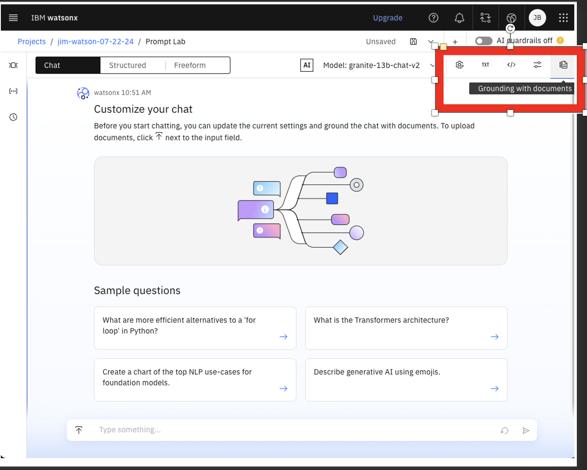
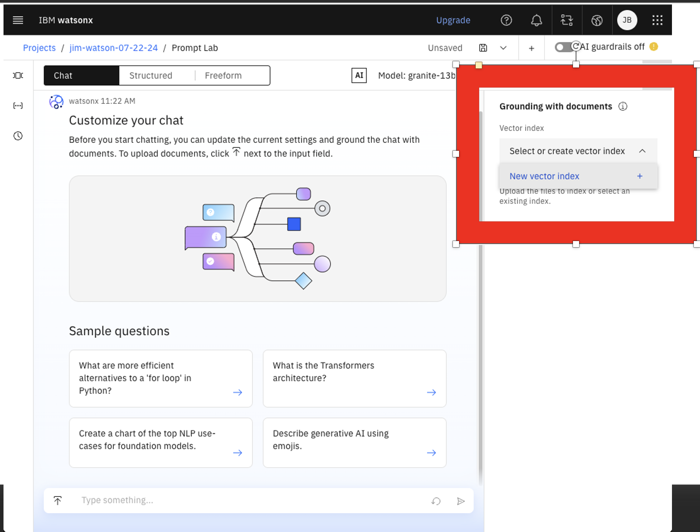
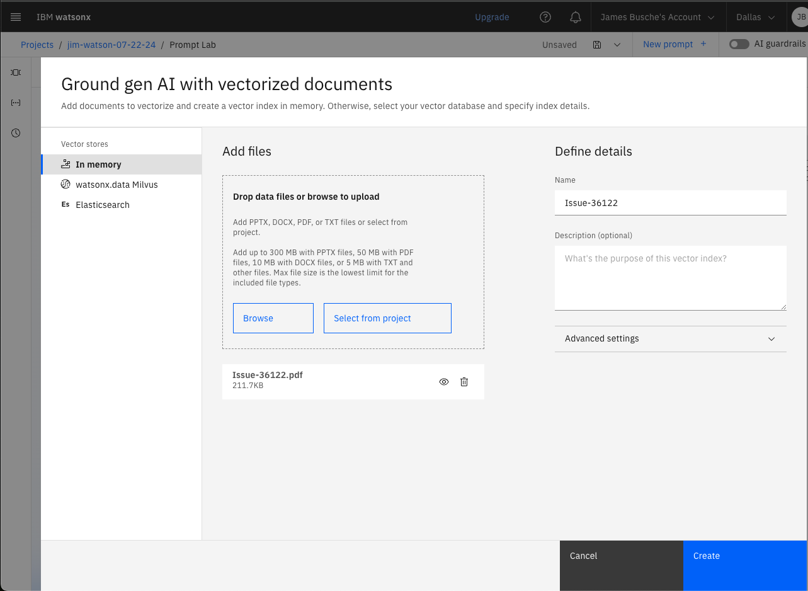
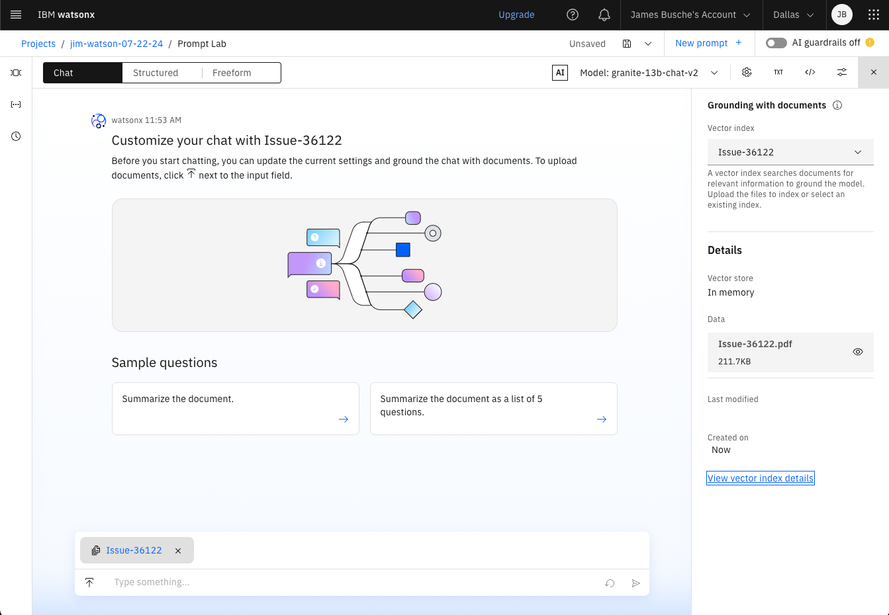
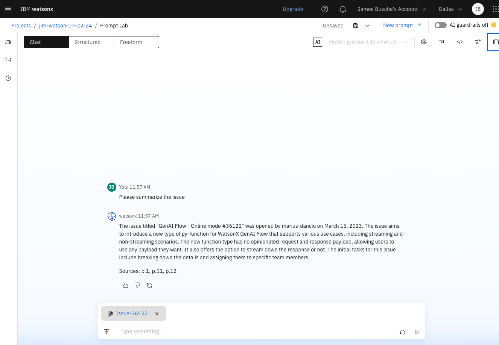
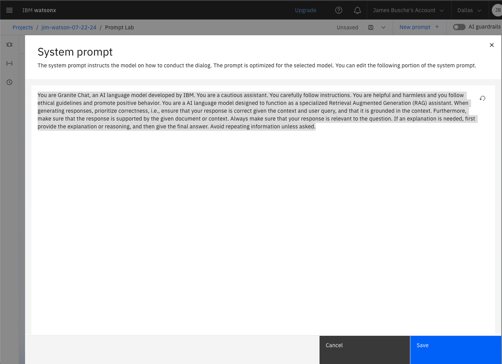

# Learning about RAG (retrieval augmented generation)

**Note:** The following images show actual results from watsonx.ai. The gray text is what we provided to the model. The blue highlighted text is how the model responded.

### 1.0 LLM RAG
RAG (retrieval-augmented generation) is the ability to retrieve facts from an external source to help ground LLMs and provide users detailed or updated information that otherwise might be missing in the LLM. It supplements the LLM's internal representation of information.

This has multiple benefits.
- Reduces hallucinations
- Helps ensure the model has the most current, reliable facts
- Reduces the need to continuously retrain LLM models on new data, reducing time and cost




### 1.1 How to add grounding data:

First, obtain the document you want to add.  For example, download to your laptop
https://github.com/IBM/watsonx-prompt-lab/blob/main/docs/lab-2/issue-36122.pdf

Next, click on "Grounding with documents" and then click on "Select or create vector index" and then "New vector index"



Files can be added in PPTX, DOCX, PDF or TXT format with the following sizes:

```
PPTX: Up to 300 MB
PDF : Up to 50 MB
DOCX: Up to 10 MB
TXT : Up to 5 MB
```

Click on "Browse" and add the file `issue-36122.pdf` you downloaded earlier.

Note, the Name will auto-fill based on the name of the document you add



Click "Create"

The chat interface then shows that it has the RAG (grounding data) appended as part of the chat:



### 1.2 Using the grounding data
Now you can ask questions and the grounding data will be used to help complete the answer and will indicate the pages it used for the source.

For example, enter "Please summarize the issue" and you'll get something like this:



### 2.0 A note about the general chat feature
Unlike the exercises where we were using Structured or Freeform mode, the Chat page has less customizable parameters to set for it, and the token limits are higher.  If you click on the "Edit System Prompt" you'll see some non-obvious instructions being provided to the LLM:

```
You are Granite Chat, an AI language model developed by IBM. You are a cautious assistant. You carefully follow instructions. You are helpful and harmless and you follow ethical guidelines and promote positive behavior. You are a AI language model designed to function as a specialized Retrieval Augmented Generation (RAG) assistant. When generating responses, prioritize correctness, i.e., ensure that your response is correct given the context and user query, and that it is grounded in the context. Furthermore, make sure that the response is supported by the given document or context. Always make sure that your response is relevant to the question. If an explanation is needed, first provide the explanation or reasoning, and then give the final answer. Avoid repeating information unless asked.
```

Clearly you can change these settings as needed, but this is a good starting point for a well-behaved AI assistant.




