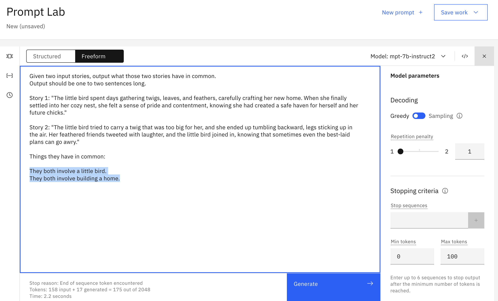
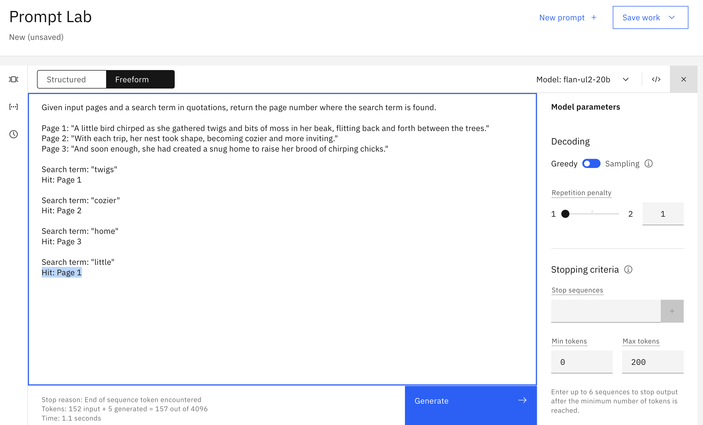
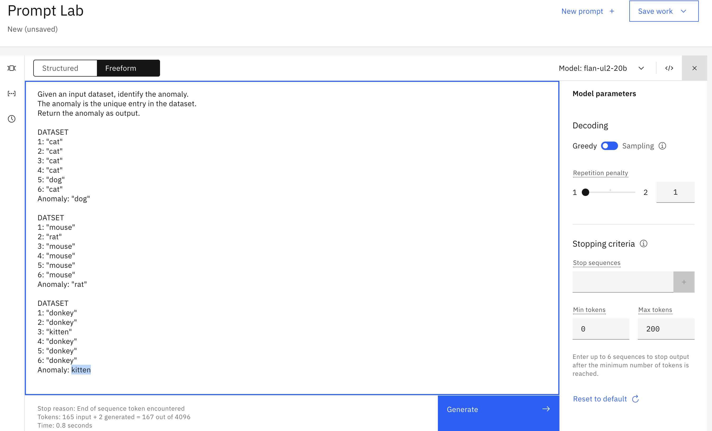

# Creating prompts in watsonx.ai's Prompt Builder

Complete the following exercises using watsonx.ai's Prompt Builder.

**Exercises**

| No. |                       Exercise                       |                      Summary                      |
|-----|:----------------------------------------------------:|:-------------------------------------------------:|
| 1   |               [Generate](#1-generate)                |        Write three sentences about donkeys        |
| 2   |                [Rewrite](#2-rewrite)                 |            Transform Markdown to HTML             |
| 3   |              [Summarize](#3-summarize)               |              Summarize a short story              |
| 4   |         [Summary points](#4-summary-points)          | Create a list of topics from a meeting transcript |
| 5   |        [Text extraction](#6-text-extraction)         |           Extract verbs from a sentence           |
| 6   |                [Compare](#7-compare)                 |       Identify what passages have in common       |
| 7   |            [Text search](#8-text-search)             |  Find which page contains the sought-after text   |
| 8   |               [Classify](#9-classify)                |           Detect chatbot users' intent            |
| 9  |      [Anomaly detection](#10-anomaly-detection)      |              Spot the odd entry out               |
| 10  |          [Math question](#11-math-question)          |       How many minutes are there in a day?        |

## 1. Generate

Get a model to output three creative sentences about donkeys. You can use the examples below to help.

```
3 sentences about puppies:
- The puppy spun in circles, trying to catch his tail, but ended up tumbling over and over.
- His antics had his owners laughing out loud, and even the other puppies at the park stopped to watch the silly sight.
- As soon as the two puppies met at the park, their tails began to wag and they bounded around each other with glee.
```

```
3 sentences about kittens:
- The little kitten lapped up the milk with her tiny pink tongue, making a cute slurping sound.
- The kitten nibbled on the treat, savoring every morsel of the delicious flavor.
- As soon as the package was opened, the little kitten's eyes lit up with excitement.
```

<details>
<summary> Show example answer </summary>

</details>

## 2. Rewrite

Here's an example of a conversion between Markdown and HTML:

```
Markdown:
## Welcome to My Blog!
I'm thrilled to launch my new blog and share my thoughts with you. Expect a wide range of topics including technology, travel, and growth. Stay tuned for engaging and informative posts!

HTML:
<h2>Welcome to My Blog!</h2>
<p>I'm thrilled to launch my new blog and share my thoughts with you. Expect a wide range of topics including technology, travel, and growth. Stay tuned for engaging and informative posts!</p>
```

Get a model to output the HTML version of any of the following Markdown snippets. 

```
## Background
The [IBM Watson Natural Language Processing library](https://dataplatform.cloud.ibm.com/docs/
content/wsj/analyze-data/watson-nlp.html) is a Python library that provides basic natural
language processing (NLP) such as syntax analysis and keyword extraction with out-of-the-box,
pre-trained models. The Watson NLP library also makes it simple to customize the language
models with dictionaries of your domain-specific terms.
```
```
[MURAL](https://mural.co) is an online tool that is like a virtual whiteboard: you can draw
shapes, stick notes, and move things around. It’s a fabulous tool for visually organizing ideas,
designing solutions, and collaborating with teammates — in real time or asynchronously.
```
```
## Function
Using LLMs is pretty easy: prompt the model with text (eg. "I took my dog") and the model
generates text as output (eg. "for a walk").
```
```
## Hall of shame: when LLMs go wrong
Even the creators of LLMs cannot always fully anticipate or explain these models' output:
[ChatGPT's creators can’t figure out why it won’t talk about Trump](https://www.semafor.com/
article/02/03/2023/how-chatgpt-inadvertently-learned-to-avoid-talking-about-trump)
```

<details>
<summary> Show example answer </summary>

</details>

<p>&nbsp;</p>


## 3. Summarize

Get a model to output a short summary of any of the following short stories.

```
A little bird chirped as she gathered twigs and bits of moss in her beak, flitting back and
forth between the trees. With each trip, her nest took shape, becoming cozier and more inviting.
And soon enough, she had created a snug home to raise her brood of chirping chicks.
```
```
As soon as the package was opened, the little cat's eyes lit up with excitement. She pounced
on the new toy, batting it around the room with joyous abandon. With a contented purr, she
snuggled up with her toy, feeling grateful for the love and attention of her caring owner.
```
```
The ship heaved and tossed on the angry sea as the storm raged on. Waves as tall as mountains
crashed against the hull, threatening to capsize the vessel. But the captain and crew held
steady, navigating the treacherous waters with skill and determination, until finally, the
storm subsided and the ship emerged triumphant, battered but unbroken.
```
```
As soon as the two dogs met at the park, their tails began to wag and they bounded around
each other with glee. Their owners struck up a conversation, and soon found that they had
much in common, bonding over their shared love of dogs and the outdoors. By the end of the
day, new friendships had been formed, and both the dogs and their owners left the park with
happy hearts and wagging tails.
```

<details>
<summary> Show example answer </summary>

</details>

## 4. Summary points

Prompt a model to create a list of topics from any of the following meeting transcripts.

```
00:00   [sam]   I wanted to share an update on project X today.
00:15   [sam]   Project X will be completed at the end of the week.
00:30   [erin]  That's great!
00:35   [erin]  I heard from customer Y today, and they agreed to buy our product.
00:45   [alex]  Customer Z said they will too.
01:05   [sam]   Great news, all around.
```
```
00:00   [ali]   The goal today is to agree on a design solution.
00:12   [alex]  I think we should consider choice 1.
00:25   [ali]   I agree
00:40   [erin]  Choice 2 has the advantage that it will take less time.
01:03   [alex]  Actually, that's a good point.
01:30   [ali]   So, what should we do?
01:55   [alex]  I'm good with choice 2.
02:20   [erin]  Me too.
02:45   [ali]   Done!
```
```
00:00   [alex]  Let's plan the team party!
00:10   [ali]   How about we go out for lunch at the restaurant?
00:21   [sam]   Good idea.
00:47   [sam]   Can we go to a movie too?
01:04   [alex]  Maybe golf?
01:15   [sam]   We could give people an option to do one or the other.
01:29   [alex]  I like this plan.  Let's have a party!
```

<details>
<summary> Show example answer </summary>

</details>


## 5. Text extraction

Extract the verbs from one of the following sentences.

```
As soon as the two dogs met at the park, their tails began to wag and they bounded
around each other with glee.
```
```
Their owners struck up a conversation, and soon found that they had much in common,
bonding over their shared love of dogs and the outdoors.
```
```
As soon as the package was opened, the little cat's eyes lit up with excitement.
```
```
She pounced on the new toy, batting it around the room with joyous abandon.
```

<details>
<summary> Show example answer </summary>

</details>


## 6. Compare

Choose one pair of passages and identify what the two have in common.

```
"The little bird spent days gathering twigs, leaves, and feathers, carefully
crafting her new home. When she finally settled into her cozy nest, she felt a
sense of pride and contentment, knowing she had created a safe haven for
herself and her future chicks."

"The little bird tried to carry a twig that was too big for her, and she
ended up tumbling backward, legs sticking up in the air. Her feathered friends
tweeted with laughter, and the little bird joined in, knowing that sometimes
even the best-laid plans can go awry."
```
```
"The little kitten lapped up the milk with her tiny pink tongue, making a cute
slurping sound. Her fuzzy face was covered in a white mustache, and she let
out a tiny purr of contentment as she finished her meal."

"The little kitten nibbled on the treat, savoring every morsel of the delicious
flavor. Her big round eyes widened with delight, and she purred contentedly,
grateful for the simple pleasure of a yummy snack."
```
```
"The puppy spun in circles, trying to catch his tail, but ended up tumbling
over and over. His antics had his owners laughing out loud, and even the other
dogs at the park stopped to watch the silly sight."

"The dog chased after the ball, wagging his tail with excitement. His owner
threw the ball again and again, and the dog happily retrieved it each time,
barking with joy."
```
```
"The naughty donkey nudged the gate open with his nose and ran out into the
meadow, braying with delight. His owner shook his head in amusement, knowing
that the playful donkey always found a way to bring a smile to his face."

"The mischievous donkey chased after the butterfly, but ended up
braying in alarm as it flew too close to his face. He stumbled backward and
tripped over his own hooves, earning a few giggles from the nearby chickens."
```

<details>
<summary> Show example answer </summary>

</details>


## 7. Text search

Get the model to output the page number that contains the text you give it.

Find which page contains the text provided.

```
Page 1: "A little bird chirped as she gathered twigs and bits of moss in her beak, flitting back and forth between the trees."
Page 2: "With each trip, her nest took shape, becoming cozier and more inviting."
Page 3: "And soon enough, she had created a snug home to raise her brood of chirping chicks."
```

Example output:
```
Search term: cozier
Page: 2

Search term: enough
Page: 3
```

<details>
<summary> Show example answer </summary>

</details>

## 8. Classify

Prompt a model to classify the users' intent like a chatbot would. An intent is similar to a user's high-level goal during a conversation. Here are some examples of user intent classes:

Class: `hi`
```
Hello

Hi there

Good evening

Hi

Hi good morning
```

Class: `question`
```
Hi I wanted to know how to export data from python notebooks?

Hi there can i recover a deleted notebook?

Hi how do you add a folder of files to a project?

Hi team How can you change the name of a Notebook?

How to upload a dataset from local to RStudio

Good morning can you help me upload a shapefile?

How to start creating R notebook?
```

Class: `problem`
```
Hi cant login today with this err The owners accout is not active. This might be caused by expired membership.

I am not able to register my account need your help

Hi I got the message failed to prepare Object-Storage. Would you please give me a suggestion. Thank you.

Hi I am trying to request a new API access key but I dont know what the ID should be for me

When I try to add a model to any project I get an Unauthorized error.
```

Below are extra input examples:
```
Hi  Anyone there?
```
```
Having issues setup WML service
```
```
Hi team how can i import data into a project?
```

<details>
<summary> Show example answer </summary>

</details>


## 9. Anomaly detection

Get the model to spot the odd entry out in the following dataset.

```
1: "donkey"
2: "donkey"
3: "kitten"
4: "donkey"
5: "donkey"
6: "donkey"
```

<details>
<summary> Show example answer </summary>

</details>


## 10. Math question

Prompt the model to deduce the answer to the question "how many minutes are there in a day?"

<details>
<summary> Show example answer </summary>

</details>


