# Prompt engineering exercise answers

<table>
<tr>
<td><a href="#1-generate">1. Generate</a></td>
<td>Write three sentences about donkeys</td>
</tr>
<tr>
<td><a href="#2-rewrite">2. Rewrite</a></td>
<td>Transform Markdown to HTML</td>
</tr>
<tr>
<td><a href="#3-summarize">3. Summarize</a></td>
<td>Summarize a short story</td>
</tr>
<tr>
<td><a href="#4-summary-points">4. Summary points</a></td>
<td>Create a list of topics from a meeting transcript</td>
</tr>
<tr>
<td><a href="#5-study-questions">5. Study questions</a></td>
<td>Anticipate potential customer questions</td>
</tr>
<tr>
<td><a href="#6-text-extraction">6. Text extraction</a></td>
<td>Extract verbs from a sentence</td>
</tr>
<tr>
<td><a href="#7-compare">7. Compare</a></td>
<td>Identify what passages have in common</td>
</tr>
<tr>
<td><a href="#8-text-search">8. Text search</a></td>
<td>Find which page contains the sought-after text</td>
</tr>
<tr>
<td><a href="#9-classify">9. Classify</a></td>
<td>Detect chatbot users' intent</td>
</tr>
<tr>
<td><a href="#10-anomaly-detection">10. Anomaly detection</a></td>
<td>Spot the odd entry out</td>
</tr>
<tr>
<td><a href="#11-math-question">11. Math question</a></td>
<td>How many minutes are there in a day?</td>
</tr>
<tr>
<td><a href="#12-write-like-shakespeare">12. Write like Shakespeare</a></td>
<td>Rewrite a passage like Shakespeare</td>
</tr>
</table>

&nbsp;

## 1. Generate
**Goal** 
<table>
<tr>
<td>
Write three sentences about donkeys
</td>
</tr>
</table>

**One possible answer**

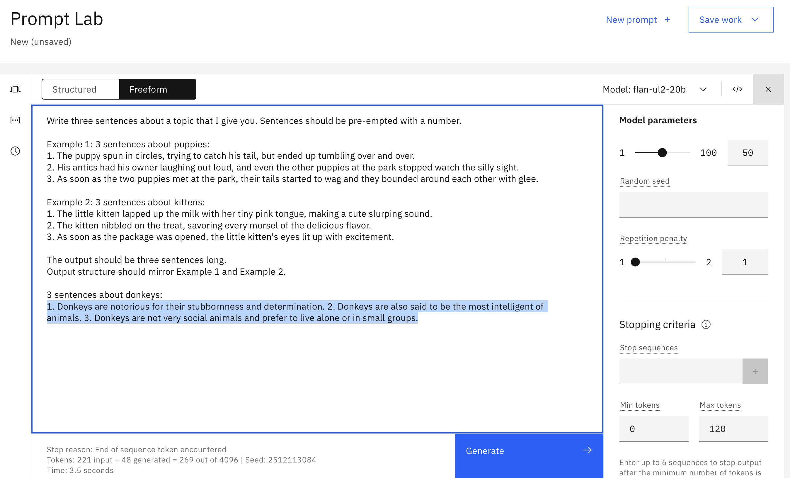

&nbsp;

## 2. Rewrite
**Goal** 
<table>
<tr>
<td>
Transform one of these Markdown passages to HTML
</td>
</tr>
</table>

**One possible answer**

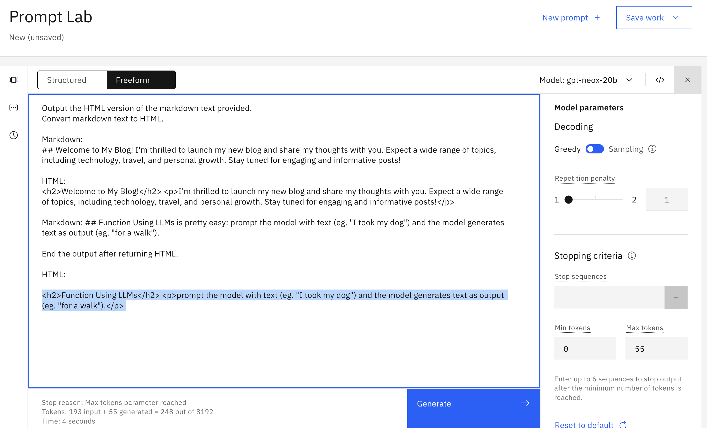

&nbsp;

## 3. Summarize
**Goal** 
<table>
<tr>
<td>
Summarize one of these short stories
</td>
</tr>
</table>
  
**One possible answer**

&nbsp;

## 4. Summary points
**Goal** 
<table>
<tr>
<td>
Create a list of topics from one of these meeting transcripts
</td>
</tr>
</table>

**One possible answer**

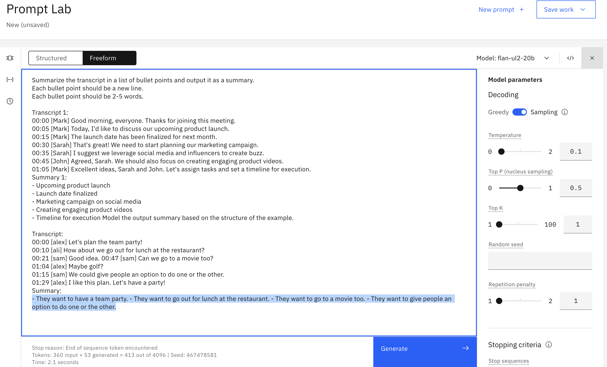

&nbsp;

## 5. Study questions
**Goal** 
<table>
<tr>
<td>
Create a list of questions a customer might have about one of these topic passages
</td>
</tr>
</table>

**One possible answer**

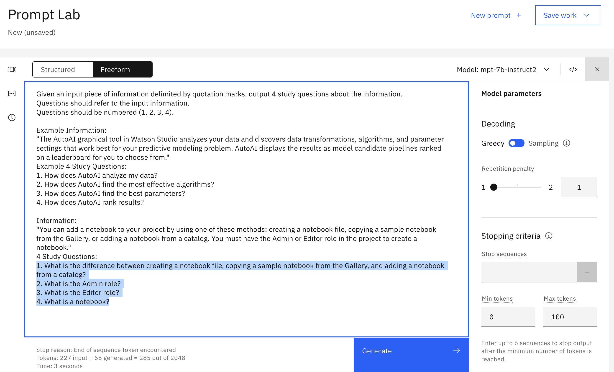

&nbsp;

## 6. Text extraction
**Goal** 
<table>
<tr>
<td>
Extract verbs from one of these sentences
</td>
</tr>
</table>

**One possible answer**

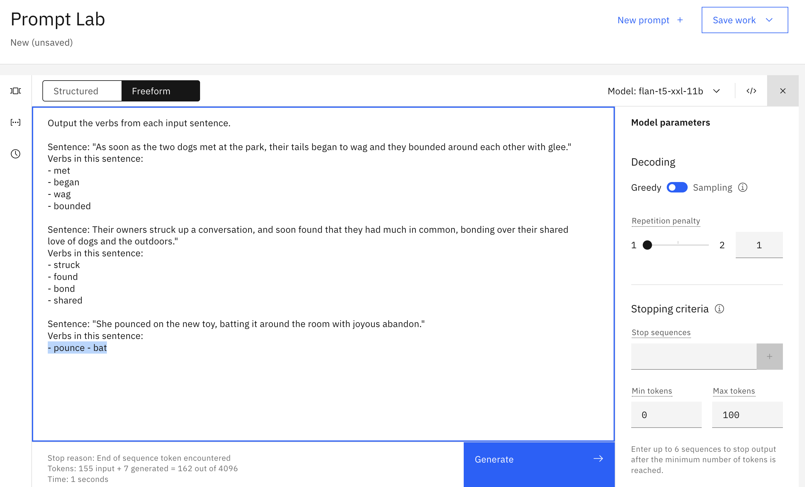

&nbsp;

## 7. Compare
**Goal** 
<table>
<tr>
<td>
Choose one pair of passages and identify what the passages have in common
</td>
</tr>
</table>

**One possible answer**

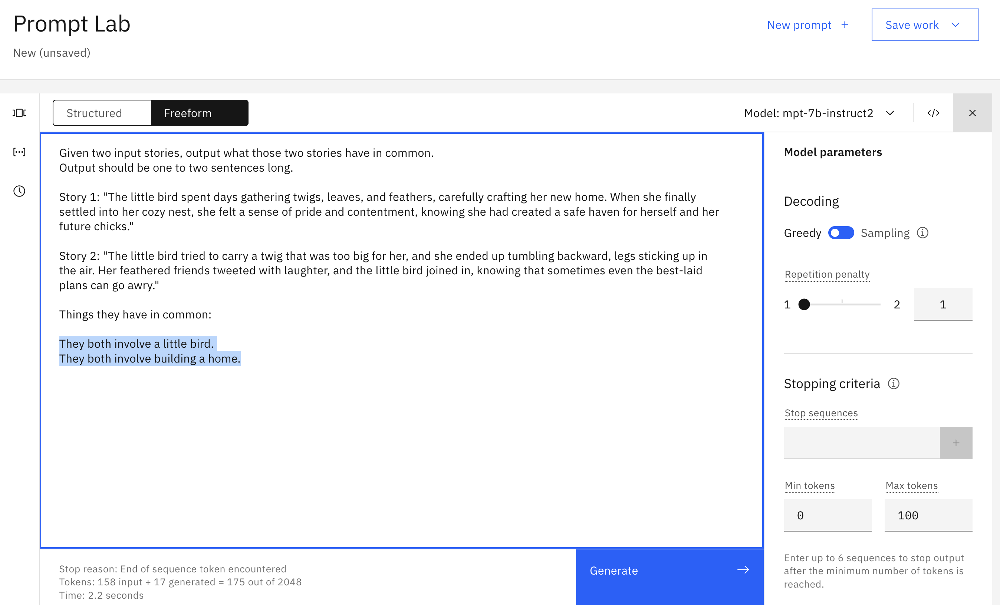

&nbsp;

## 8. Text search
**Goal** 
<table>
<tr>
<td>
Find which page contains the sought-after text
</td>
</tr>
</table>

**One possible answer**

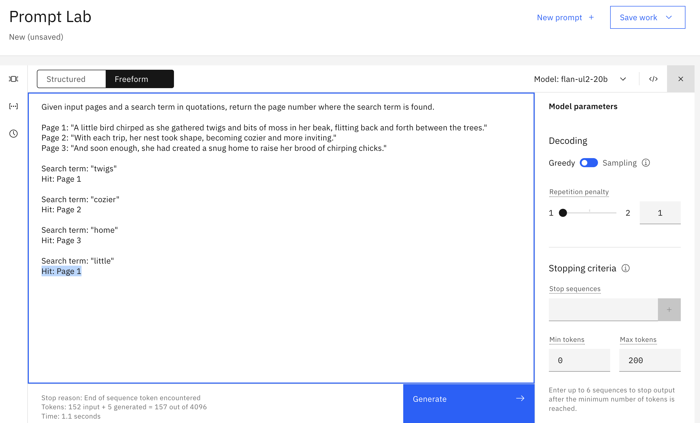

&nbsp;

## 9. Classify
**Goal** 
<table>
<tr>
<td>
Detect chatbot users' intent
</td>
</tr>
</table>

**One possible answer**

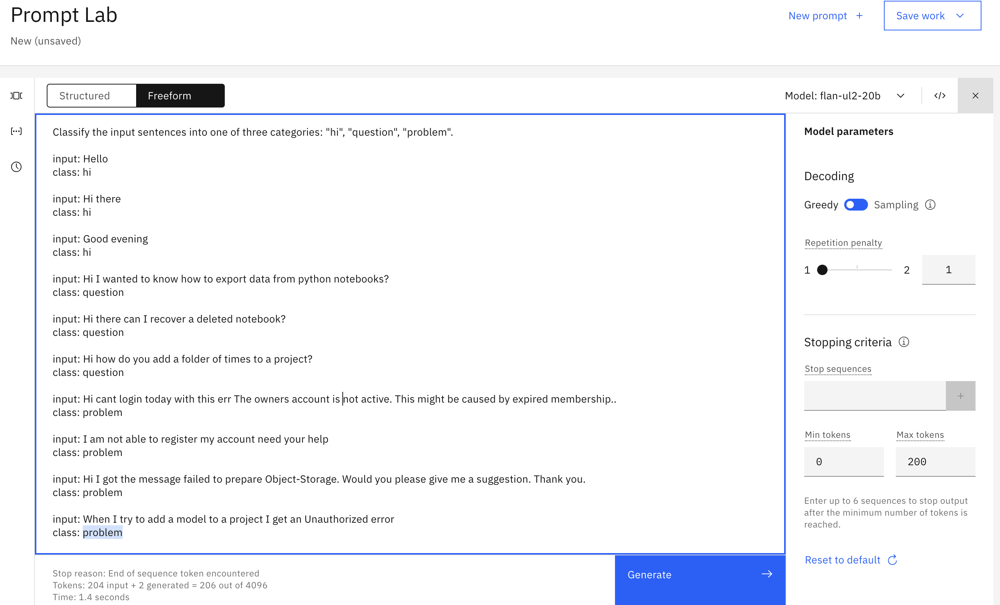

&nbsp;

## 10. Anomaly detection
**Goal** 
<table>
<tr>
<td>
Spot the odd entry out
</td>
</tr>
</table>

**One possible answer**

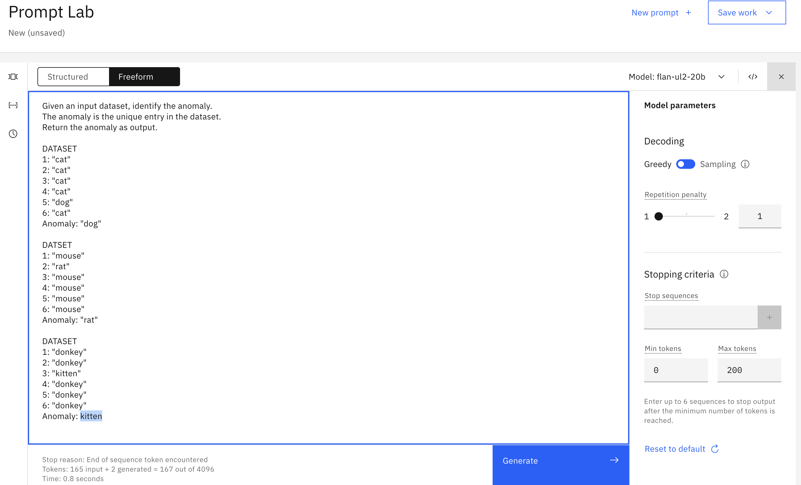

&nbsp;

## 11. Math question
**Goal** 
<table>
<tr>
<td>
How many minutes are there in a day?
</td>
</tr>
</table>

**One possible answer**

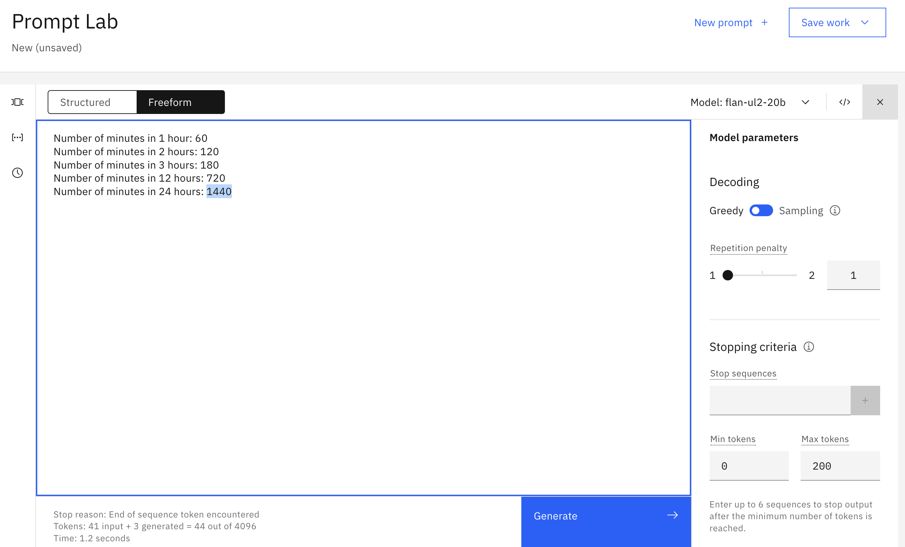

&nbsp;

## 12. Write like Shakespeare
**Goal** 
<table>
<tr>
<td>
Rewrite this story in the style of Shakespeare
</td>
</tr>
</table>

**One possible answer**

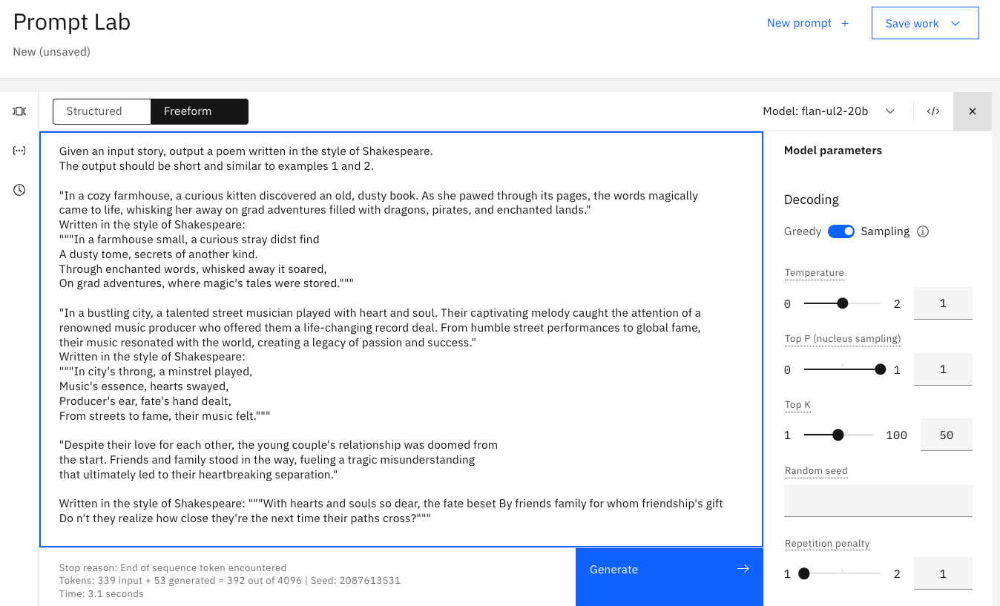

&nbsp;

## Note
All of the sentences and stories - about birds, puppies, kittens, donkeys, and shakespeare - were generated using chatGPT.

&nbsp;

