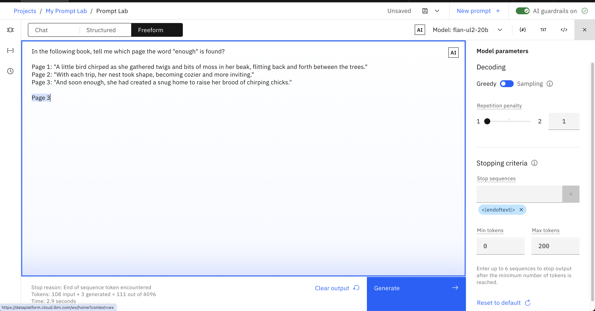

# Apply What You Learned

Complete the following exercises using watsonx.ai's Prompt Lab. 

- **Be curious!** Try different, smaller models: do you have to improve your prompt or change parameters to get a satisfactory output?
- **Be creative!** Numbered or bulleted list? Feel free to interpret the exercise yourself and make the output look the way you want to.
- **Be specific!** Aim for perfection. Use descriptive language, examples, and parameters to perfect your output.

**Exercises**

| No. |                  Exercise                  |                  Summary                  |
|-----|:------------------------------------------:|:-----------------------------------------:|
| 1   |          [Generate](#1-generate)           |         Write creative sentences          |
| 2   |           [Rewrite](#2-rewrite)            |        Transform Markdown to HTML         |
| 3   |         [Summarize](#3-summarize)          |          Summarize a short story          |
| 4   |    [Summary Topics](#4-summary-points)     | List the topics from a meeting transcript |
| 5   |   [Text Extraction](#5-text-extraction)    |       Extract verbs from a sentence       |
| 6   |           [Compare](#6-compare)            |   Identify what passages have in common   |
| 7   |       [Text Search](#7-text-search)        |     Find which page contains the text     |
| 8   |          [Classify](#8-classify)           |          Detect a users' intent           |
| 9   | [Anomaly Detection](#9-anomaly-detection)  |          Spot the odd entry out           |
| 10  |     [Math Question](#10-math-question)     |           Solve a math question           |
| 11  |     [RAG Questions](#11-RAG-Questions)     |           Additional questions for RAG    |

## 1. Generate

**Get a model to output three creative sentences about camels.** 

Can you format the sentences like a list? What happens when you use `Sampling` decoding and turn `temperature` up?

You can use the examples below to help.

```
3 sentences about puppies:
- The puppy spun in circles, trying to catch his tail, but ended up tumbling over and over.
- His antics had his owners laughing out loud, and even the other puppies at the park stopped to watch the silly sight.
- As soon as the two puppies met at the park, their tails began to wag and they bounded around each other with glee.
```

```
3 sentences about kittens:
- The little kitten lapped up the milk with her tiny pink tongue, making a cute slurping sound.
- The kitten nibbled on the treat, savoring every morsel of the delicious flavor.
- As soon as the package was opened, the little kitten's eyes lit up with excitement.
```

<details>
<summary> Show example answer </summary>

</details>

## 2. Rewrite

**Get a model to output the HTML version of the following Markdown snippets.**

```
## Background
The [IBM Watson Natural Language Processing library](https://dataplatform.cloud.ibm.com/docs/
content/wsj/analyze-data/watson-nlp.html) is a Python library that provides basic natural
language processing (NLP) such as syntax analysis and keyword extraction with out-of-the-box,
pre-trained models. The Watson NLP library also makes it simple to customize the language
models with dictionaries of your domain-specific terms.
```
```
[MURAL](https://mural.co) is an online tool that is like a virtual whiteboard: you can draw
shapes, stick notes, and move things around. It’s a fabulous tool for visually organizing ideas,
designing solutions, and collaborating with teammates — in real time or asynchronously.
```
```
## Function
Using LLMs is pretty easy: prompt the model with text (eg. "I took my dog") and the model
generates text as output (eg. "for a walk").
```
```
## What Are Large Language Models (LLMs)?
[Large language models](https://www.ibm.com/topics/large-language-models) are AI systems capable of understanding and generating human language by processing vast amounts of text data.
```

Here's an example of a conversion between Markdown and HTML:

```
Markdown:
## Welcome to My Blog!
I'm thrilled to launch my new blog and share my thoughts with you. Expect a wide range of topics including technology, travel, and growth. Stay tuned for engaging and informative posts!

HTML:
<h2>Welcome to My Blog!</h2>
<p>I'm thrilled to launch my new blog and share my thoughts with you. Expect a wide range of topics including technology, travel, and growth. Stay tuned for engaging and informative posts!</p>
```


<details>
<summary> Show example answer </summary>

</details>

## 3. Summarize

**Get a model to output a short one-sentence summary of the following short stories (one at a time).**

```
Perched on a delicate branch, a tiny sparrow named Luna gazed out at the sunrise, her feathers a fiery hue in the 
morning light. She trilled a sweet melody, and the forest came alive with the gentle rustle of leaves and chirping 
of her friends. With a flutter of her wings, Luna took to the sky, her heart full of joy and her spirit free.
```
```
Whiskers, a sleek black cat, prowled through the moonlit garden, her ears perked up and her tail twitching with 
excitement. She stalked her prey, a unsuspecting mouse, with stealthy precision, her eyes gleaming with a fierce 
inner light. With a swift pounce, Whiskers caught her prize, and a triumphant meow echoed through the night air.
```
```
The ship cut through the choppy waves, its sails billowing in the gusty wind as Captain James stood at the helm, 
his eyes fixed on the horizon. The crew scrambled to secure the deck as a fierce storm brewed, the ship's timbers 
creaking and groaning beneath their feet. As the storm raged on, the ship rode the turbulent seas, its fate hanging 
in the balance.
```
```
Max, a golden retriever, met Rocky, a black labrador, at the park. They sniffed each other and quickly became friends. 
Together, they played and had fun in the afternoon. They chased each other around, lapping the playground several times. 
As the sun began to set, Max and Rocky said their goodbyes, already looking forward to their next adventure together.
```

Here are some examples to inspire you:
```
Story:
As the clock struck midnight, a lone figure crept into the abandoned mansion, their flashlight casting eerie shadows 
on the walls. Suddenly, a chill ran down their spine as they stumbled upon a dusty, old portrait of a family, 
their eyes seeming to follow them around the room. The figure couldn't shake the feeling that they were being watched, 
and it wasn't until they heard the faint whisper of "welcome home" that they realized they weren't alone.

Summary:
A lone figure uncovers a mysterious presence in an abandoned mansion.
```

```
Story:
As the door swung open, a chilly gust of air swept into the coffee shop, carrying with it the scent of rain and the 
promise of a new customer. Amal, a regular, strode in, shaking the droplets from her umbrella and smiling wearily 
at Emma behind the counter. "The usual, please," she said, slipping onto a stool and letting out a contented sigh as 
the warm atmosphere enveloped her. Emma nodded, already reaching for the French roast beans, and began to brew a fresh 
cup.

Summary:
Amal enters a coffee shop on a rainy day and orders her usual coffee.
```

<details>
<summary> Show example answer </summary>

</details>

## 4. Summary Topics

**Prompt a model to create a bulleted list of topics from any of the following meeting transcripts.** 

```
00:00 [joe] The goal today is to finalize the budget proposal.
00:15 [sarah] I think we should allocate 30% to marketing.
00:30 [joe] That's a good starting point.
00:50 [dave] I agree, but we should also consider allocating 20% to research and development.
01:15 [sarah] That's a good point. What about the remaining 50%?
01:40 [dave] We could use it for operational costs.
02:05 [joe] I think that's a solid plan. Are we all in agreement?
02:30 [sarah] Yes, I am.
02:50 [dave] Me too.
03:15 [joe] Done!
```
```
00:00 [jess] Let's plan the company picnic!
00:10 [ali] How about we have it at the beach?
00:21 [sarah] Good idea.
00:35 [ali] Can we have a BBQ and games too?
00:50 [jess] Maybe we could also have a potluck?
01:05 [sarah] That way everyone can bring something to share.
01:20 [ali] We could also set up a few outdoor activities like volleyball and badminton.
01:40 [jess] I like this plan. Let's make it happen!
```

Here's an example:
```
Transcript:
00:00 [jane] What's the status on Project A?
00:15 [bob] We're still waiting on the Johnson report for Project B.
00:30 [jane] Can we get an update on the timeline for Project C?
00:45 [bob] I'll send out an email with the latest information.
01:02 [jane] Also, let's schedule a meeting with the marketing team to discuss the campaign for Project D.
01:18 [bob] I'll set it up for next Thursday.
01:35 [jane] Sounds good. Let's move forward with the plan.

Summary:
- Project A is waiting on Project B
- Project C update will be emailed
- Project D will be discussed next Thursday
```

<details>
<summary> Show example answer </summary>

</details>


## 5. Text Extraction

**Extract only the verbs from any of the following sentences.**

Can you make the model extract only the present tense conjugation verb? (e.g. `pounce` instead of `pounced`) 

```
I will run, jump, and dance to the music festival tonight.
```
```
Their colleagues gathered around the water cooler, and soon discovered that they had much in common, connecting over their shared passion for music and travel.
```
```
As soon as the package was opened, the little cat's eyes lit up with excitement.
```
```
She pounced on the new toy, batting it around the room with joyous abandon.
```

Here are a couple of examples:

```
Sentence:
As soon as the two dogs met at the park, their tails began to wag and they bounded around each other with glee.
Verbs:
met, begin, wag, bound

Sentence:
Their owners struck up a conversation, and soon found that they had much in common,
bonding over their shared love of dogs and the outdoors.
Verbs:
strike, found, bond

```

<details>
<summary> Show example answer </summary>

</details>


## 6. Compare

**Identify what any of the pairs of passages below have in common.**

You can start by listing common elements (e.g. a bird, the wind), but what about common themes? (e.g. the beauty of the sun) 

```
The bird sat on the windowsill, its bright feathers a splash of color
against the drab gray wall. It cocked its head to one side, as if listening
to the distant chirping of its fellow birds. The morning sunlight
streamed through the window, casting a warm glow over the bird's
plumage.

The bird took to the skies, its wings beating rapidly as it soared above
the treetops. The wind ruffled its feathers, but it flew with ease, its eyes
scanning the landscape below for signs of food or danger. The sun was
high overhead, casting a warm glow over the bird's feathers as it flew
over the fields and forests.
```
```
It's windy as the sun sets over the horizon, casting a warm glow on the 
landscape.

A gentle breeze rustles the leaves of the trees as the sun begins to set 
and colour the landscape.
```
```
"The dog wagged its tail excitedly as it waited for its owner to come
home. It had been a long day, and the dog was eager to play and receive
some attention. As soon as it heard the door open, the dog ran to greet
its owner, tail wagging furiously."

"The dog lay on its bed, panting softly as it watched its owner pack
up the car. It had been a long day, and the dog was tired but content.
As soon as its owner gave it a pat and a treat, the dog settled in for a
well-deserved nap."
```
```
"The old woman sat on the beach, watching the sun set over the ocean. He
thought about his life, and the memories he had made with his loved ones.
As the stars began to twinkle in the sky, he felt a sense of peace wash over
him, knowing that he had lived a full and happy life."

"The old woman sat on the mountain, watching the sun rise over the
valley. She thought about her life, and the lessons she had learned from her
experiences. As the mist cleared from the valley, she felt a sense of
contentment, knowing that she had lived a life of purpose and meaning."
```

<details>
<summary> Show example answer </summary>

</details>


## 7. Text Search

**Get the model to output the page number that contains the text you give it.**

Start simple and format the output however you like. For a challenge, can you get the model to find words that appear on multiple pages?

```
Page 1: "A little bird chirped as she gathered twigs and bits of moss in her beak, flitting back and forth between the trees."
Page 2: "With each trip, her nest took shape, becoming cozier and more inviting."
Page 3: "And soon enough, she had created a snug home to raise her brood of chirping chicks."
Page 4: "As the sun began to rise, casting a warm glow over the forest, the little bird sang a sweet lullaby to her chicks."
Page 5: "The chicks fluttered around their mother, their tiny voices joining in harmony with her own."
Page 6: "Together, they spent the day exploring the forest, playing and growing stronger by the minute."
```

Example output:
```
Search term: cozier
Page: 2

Search term: enough
Page: 3
```

Here's an example input you can build upon: 
```
Story:
Page 1: "The wolf walked with purpose, his powerful legs taking him through the snowy terrain."
Page 2: "He scanned the landscape, his keen eyes searching for any sign of prey or danger."
Page 3: "The moon's glow illuminated his path, casting long, dancing shadows on the frozen ground."

Term: wolf
Page: 1

Term: keen
Page: 2
```

<details>
<summary> Show example answer </summary>

</details>

## 8. Classify

**Prompt a model to classify the users' intent like a chatbot would.** 

An intent is similar to a user's high-level goal during a conversation. Can the model classify the intent of a user's message? 

Here are some examples of intent classes:

Class: `hi`
```
Hello

Hi there

Good evening

Hi

Hi good morning
```

Class: `question`
```
Hi I wanted to know how to export data from python notebooks?

Hi there can i recover a deleted notebook?

Hi how do you add a folder of files to a project?

Hi team How can you change the name of a Notebook?

How to upload a dataset from local to RStudio

Good morning can you help me upload a shapefile?

How to start creating R notebook?
```

Class: `problem`
```
Hi cant login today with this err The owners accout is not active. This might be caused by expired membership.

I am not able to register my account need your help

Hi I got the message failed to prepare Object-Storage. Would you please give me a suggestion. Thank you.

Hi I am trying to request a new API access key but I dont know what the ID should be for me

When I try to add a model to any project I get an Unauthorized error.
```

Below are extra input examples:
```
Hi  Anyone there?
```
```
Having issues setup WML service
```
```
Hi team how can i import data into a project?
```

<details>
<summary> Show example answer </summary>

</details>

## 9. Anomaly Detection

**Get the model to spot the odd entry out in any the following datasets.** 

Start by just identifying the outlier, then try to get the model to tell you both the name and its entry number. 

```
1: "donkey"
2: "donkey"
3: "kitten"
4: "donkey"
5: "donkey"
6: "donkey"
```
```
1: "cat"
2: "cat"
3: "cat"
4: "cat"
5: "dog"
6: "cat"
```
```
1: "mouse"
2: "mouse"
3: "mouse"
4: "rat"
5: "mouse"
6: "mouse"
```

<details>
<summary> Show example answer </summary>

</details>

## 10. Math Question

**Prompt the model to deduce the answer to the question: _how many minutes are there in a day?_**

<details>
<summary> Show example answer </summary>

</details>

## 11. RAG Questions
**What additional questions can be included for the example RAG issue?**
```
Conclusions that can be deduced from the issue
Next set of actions to make progress on the issue
A list of the key stakeholders and owners involved with the issue
Any risks and dependencies related to the GitHub issue
An ETA for delivery from the GitHub issue
```

Feel free to add your own PPTX (max of 300MB), PDF (max of 50MB), DOCX (max of 10MB), or TXT files (max of 5MB) as grounding data and experiement with your own questions.


