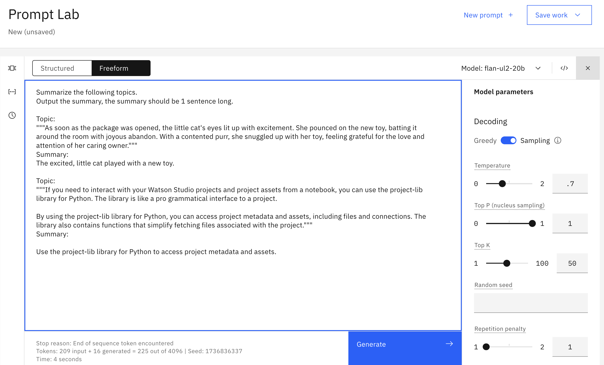
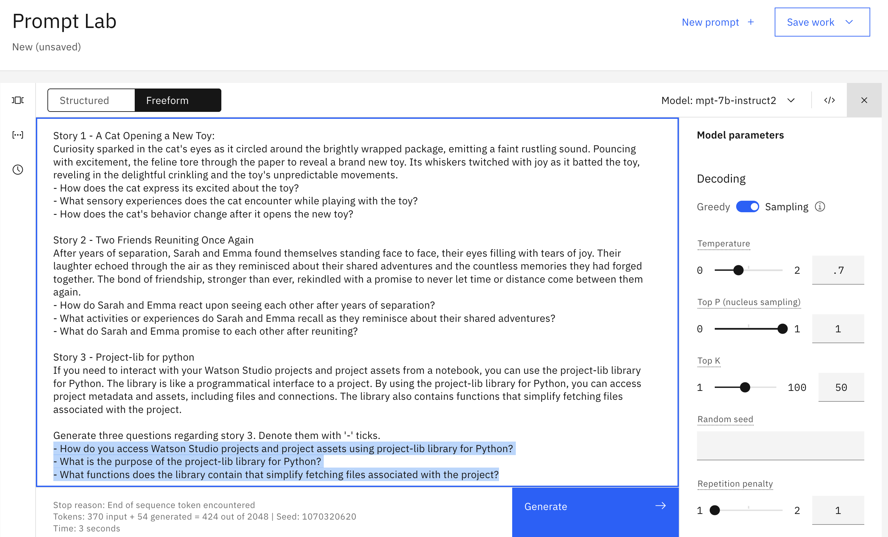
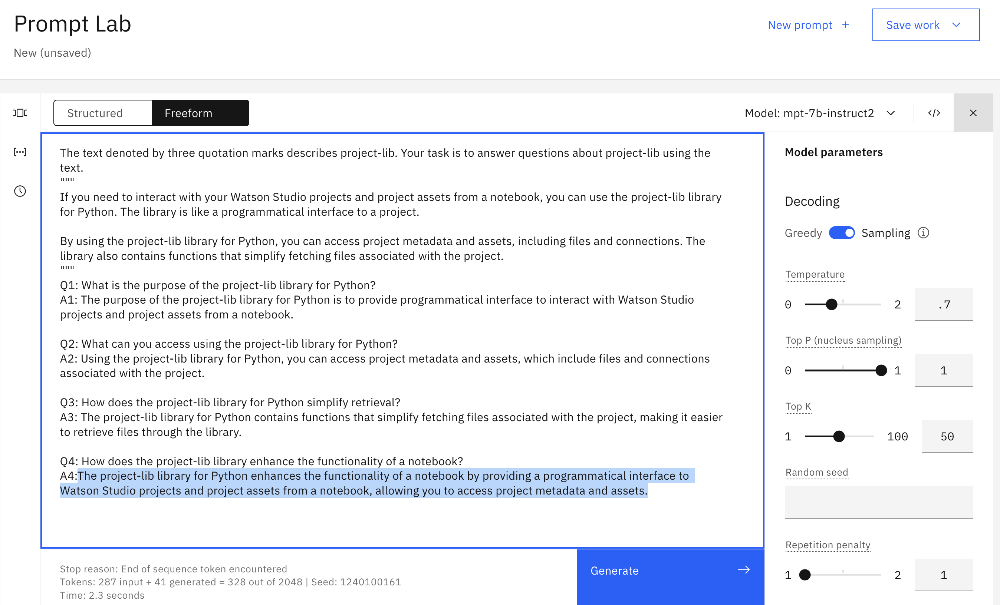

# Prompts with content exercise answers

<table>
<tr>
<td><a href="#1-summarize-documentation-topic">1. Summarize topic</a></td>
<td>Create a short summary of a documentation topic</td>
</tr>
<tr>
<td><a href="#2-documentation-topic-summary-points">2. Topic summary points</a></td>
<td>Create a list of summary points for a documentation topic</td>
</tr>
<tr>
<td><a href="#3-documentation-topic-study-questions">3. Study questions for a topic</a></td>
<td>Create a list of questions for a documentation topic</td>
</tr>
<tr>
<td><a href="#4-documentation-topic-answer-questions">4. Answer questions about a topic</a></td>
<td>Answer questions about a documentation topic</td>
</tr>
</table>

&nbsp;

## 1. Summarize documentation topic
**Goal** 
<table>
<tr>
<td>
Summarize this topic from the Cloud Pak for Data docs: <a href="https://dataplatform.cloud.ibm.com/docs/content/wsj/analyze-data/project-lib-python.html">Using project-lib for Python</a>
</td>
</tr>
</table>

**One possible answer**

&nbsp;

## 2. Documentation topic summary points
**Goal** 
<table>
<tr>
<td>
List summary points for this topic from the Cloud Pak for Data docs: <a href="https://dataplatform.cloud.ibm.com/docs/content/wsj/analyze-data/project-lib-python.html">Using project-lib for Python</a>
</td>
</tr>
</table>

**One possible answer**

&nbsp;

## 3. Documentation topic study questions
**Goal** 
<table>
<tr>
<td>
Generate study questions for this topic from the Cloud Pak for Data docs: <a href="https://dataplatform.cloud.ibm.com/docs/content/wsj/analyze-data/project-lib-python.html">Using project-lib for Python</a>
</td>
</tr>
</table>
  
**One possible answer**

&nbsp;

## 4. Documentation topic answer questions
**Goal** 
<table>
<tr>
<td>
Answer questions about this topic from the Cloud Pak for Data docs: <a href="https://dataplatform.cloud.ibm.com/docs/content/wsj/analyze-data/project-lib-python.html">Using project-lib for Python</a>
</td>
</tr>
</table>
  
**One possible answer**

&nbsp;

## Note
All of the sentences and stories about birds, puppies, kittens, donkeys were generated using chatGPT.

&nbsp;

