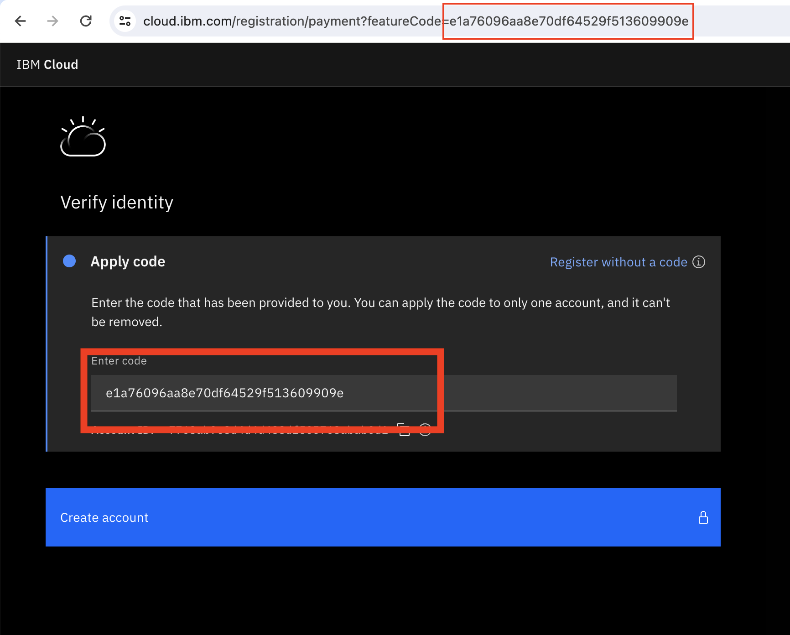
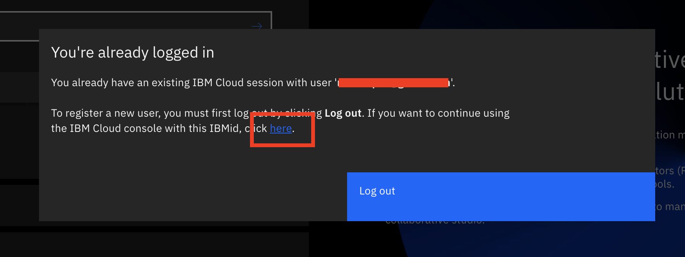

# Pre-work

Let's get prepare our environment to work through the Prompt Engineering lab.

1. [Create an IBM Cloud account](#1-create-an-ibm-cloud-account)
2. [Connect to IBM watsonx.ai](#2-connect-to-watsonxai)
3. [Create a sandbox project](#3-create-a-sandbox-project-in-watsonxai)

## 1. Create an IBM Cloud account
Go to [https://ibm.biz/watsonx-promocode](https://ibm.biz/watsonx-promocode) and request a featureCode, using the password provided by your instructor.

Click the link that looks like a long code, and sign up for an IBM Cloud account. After verifying your email, you'll see a window with the pre-filled code like below. **Simply click, `Create account`.** 

If you happen to erase the code, it can be found within the URL in the address bar. 

## 2. Connect to watsonx.ai

Go to [watsonx.ai](https://www.ibm.com/products/watsonx-ai), click "Start your free trial", and login using your newly created IBM Cloud account. You'll be able to use your free trial for this lab and further self-study, just be mindful of token limits as they vary depending by [pricing tier](https://www.ibm.com/products/watsonx-data/pricing). 

If you just created an account, the platform may tell you that you are already logged in. Simply confirm your email address, and click the word `here`. 

## 3. Create a sandbox project in watsonx.ai

A *project* is where you work with data and models by using tools. When you sign up for watsonx.ai, your sandbox project is created automatically, and you can start working in it immediately. If you don't have a project, you can manually create one too. 

Once you have a project, you'll be able to open the Prompt Lab, where you can experiment with prompting different foundation models, explore sample prompts, as well as save and share your best prompts.

Now you're ready to move on to the first lab where we'll cover the basics of prompt engineering and learn how to configure watsonx.ai for the best results. 
