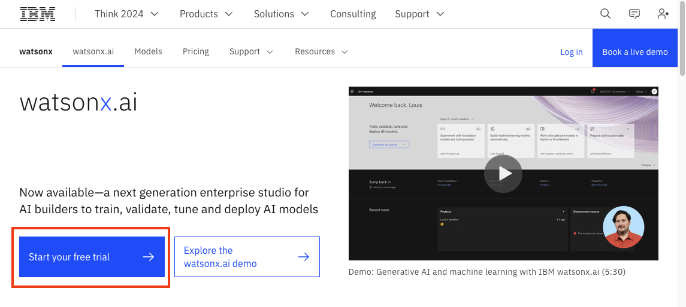
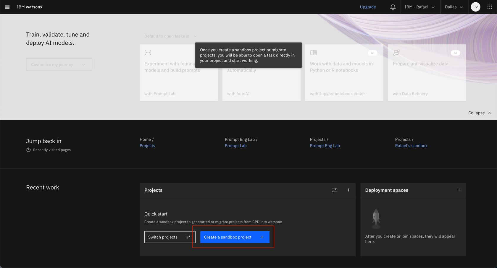
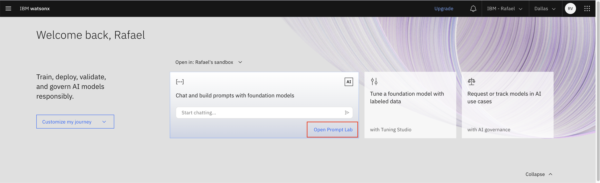

# Pre-work

Let's get prepare our environment to work through the Prompt Engineering lab.

1. [Connect to IBM watsonx.ai](#1-connect-to-watsonxai)
2. [Create a sandbox project](#2-create-a-sandbox-project-in-watsonxai)

## 1. Connect to watsonx.ai

You will use the [watsonx.ai](https://www.ibm.com/products/watsonx-ai) Prompt Lab UI for this workshop, so ensure that you can access it. To sign up, click "Start your free trial" and follow the instructions. You'll be able to use your free trial for this lab and further self-study, just be mindful of token limits as they vary depending on [pricing tier](https://www.ibm.com/products/watsonx-data/pricing).

## 2. Create a sandbox project in watsonx.ai

A *project* is where you work with data and models by using tools. When you sign up for watsonx.ai, your sandbox project is created automatically, and you can start working in it immediately. If you don't have a project, you can manually create one too. 

Once you have a project, you'll be able to open the Prompt Lab, where you can experiment with prompting different foundation models, explore sample prompts, as well as save and share your best prompts.

Now you're ready to move on to the first lab where we'll cover the basics of prompt engineering and learn how to configure watsonx.ai for the best results. 
